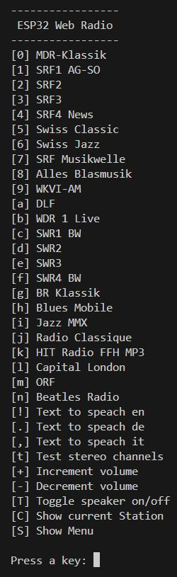
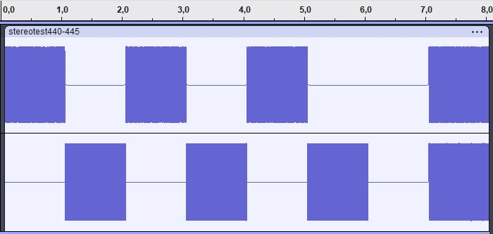
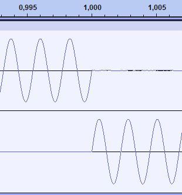

# ESP32InternetRadio

This program shows how to use the [**ESP32-audioI2S**](https://github.com/schreibfaul1?tab=repositories) library to build an internet radio. 
It is an adaptation of the example program *Simple_WiFi_Radio*.
I used a I2S MAX98357A PCM Class D Amplifier in mono configuration and also
tried stereo sound with two MAX98357A.
In contrast to the internet radio with the ESP8266, the serial 
interface is available for inputs and outputs with the ESP32. 
Therefore I designed the user interface as a simple CLI menu. 

It allows the

 * selection of 24 radio stations (easy to expand)
 * text-to-speech output with 3 examples in the languages English, German, Italian
 * stereo test to check both channels
 * volume control up and down
 * switching on and off of the loudspeaker 
 * display of the currently played radio station
 * redisplaying the menu

 

## Operation with external Max98357A
 ```
 Wiring                            .-----------------. 
               GPIO_NUM_25 -->     o LRC             |  
               GPIO_NUM_26 -->     o BCLK       MAX  |
               GPIO_NUM_27 -->     o DIN       98357 |
                                   o Gain            |   Spkr
               5V Vin ---[ Rs ]----o SD              |    _/|
                       GND -->     o GND             o---|  |
                       5V  -->     o Vin (5V)        o---|_ |
                                   `-----------------´     \|
  ```
👉 With exactly the same wiring you can also connect a 
  UDA1334A I2S DAC with stereo output for headphones.
    
  Or wire a second MAX98357 in the same way to get stereo sound 
  with two speakers. Connect SD and Vin with a 180k shunt resistor in 
  the left channel and with a 560k resistor in the right channel.

### How do we calculate the shunt resistance Rs
Internally, the SD pin is connected to the center of a voltage divider 
consisting of two resistors of 1000k to Vin and 100k to ground.

Depending on the voltage at SD, the MAX98357 is set to the shutdown state or 
it processes the signals for the left or right channel or it mixes both 
signals equally (mono mode). The permitted voltage ranges according to the 
data sheet are listed below for the various operating modes.
```
     ---+-- Vin = 5V
        |
    .---+  
    |   | 
   .-. .-.                 
Rs | | | | R1 = 1000k  Rtot = Rs * R1 / (Rs + R1)
   '-' '-'
    |   |          
    '---+ 
        |          1500 < Vs < 5000 mv (left  chn, optimal 2000 mV) ==> Rs = 176k
  SD o--+---> Vs =  825 < Vs < 1245 mv (right chn, optimal 1035 mV) ==> Rs = 621k
        |           355 < Vs <  650 mv (mono       optimal  502 mv) ==> Rs = 8617k (or no Rs)
       .-.           0 <= Vs <  355 mV (shutdown mode) 
       | |R0 = 100k
       '-'
        |
     ---+--- GND
```

We know
a) $R_{tot} = \frac{R_s \cdot R_1}{R_s + R_1}$ 

and 

$V_{SD} = V_{in} \cdot \frac{R_0}{R_{tot} + R_0}$
and so we get
$\frac{V_{SD}}{V_{in}} = \frac{R_0}{R_{tot} + R_0} = k$
and this results in

b) $R_{tot} = R_0  \cdot \frac{(1 - k)}{k}$

a) and b) are equal and from this follows

$\frac{R_s \cdot R_1}{R_s + R_1} = R_0  \cdot \frac{(1 - k)}{k}$

$k \cdot R_s \cdot R_1 = R_0 \cdot (1 - k) \cdot (R_s + R_1)$

$k \cdot R_s \cdot R_1 = R_0 \cdot Rs \cdot (1 - k) + R_0 \cdot R_1 \cdot (1 - k)$

$R_s = \frac{R_1}{\frac{R_1}{R_0} \cdot \frac{k}{1 - k} - 1}$

and finally we get

$R_s(V_{SD}) = \frac{R_1}{\frac{R_1}{R_0} \cdot \frac{V_{SD}}{V_{in} - V{SD}} - 1}$

or

$V_{SD}(R_s) = V_{in} \cdot \frac{1}{\frac{R_s \cdot R1}{R_0 \cdot (R_s+R_1)}+1}$

### Stereo test
For the stereo test, I created a file *stereotest440-445.mp3* with Audacity: 



In the upper left channel there are 4 clips with 440 Hz sine waves, in the 
lower right channel the same number of clips with 445 Hz. The first 3 clips 
sound alternately left then right and the last two together, resulting in a 
clearly audible beat of 5 Hz.

The next image shows an enlarged section of the transition from the left to the right channel after 1 second. 



This arrangement makes it easy to check whether the shunt resistors for 
selecting the stereo channels are correctly dimensioned.

The file stereotest440-445.mp3 is located in the data folder and must be 
loaded before compilation with *Upload Filesystem Image* into SPIFFS.

### platformio.ini

The partition scheme for large applications must be defined in the 
*platformio.ini* configuration file, otherwise the available program memory 
will be too small. You have to add the following line:

*board_build.partitions = huge_app.csv*

