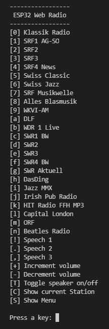

# ESP32InternetRadio

This program shows how to use the [**ESP32-audioI2S**](https://github.com/schreibfaul1?tab=repositories) library to build a internet radio. 
It is an adaptation of the example program *Simple_WiFi_Radio*.
I used a MAX98357A DAC/Amplifier in mono configuration.
In contrast to the internet radio with the ESP8266, the serial 
interface is available for inputs and outputs with the ESP32. 
Therefore I designed the user interface as a simple CLI menu. 

It allows the

 * selection of 24 radio stations (easy to expand)
 * text-to-speech output with 3 examples in the languages 
   * English, German, Italian
 * volume control up and down
 * switching on and off of the loudspeaker 
 * display of the currently played radio station
 * redisplaying the menu

 

### Operation with external Max98357
 ```
 Wiring                            .-----------------. 
               GPIO_NUM_25 -->     o LRC             |  
               GPIO_NUM_26 -->     o BCLK       MAX  |
               GPIO_NUM_27 -->     o DIN       98357 |
                                   o Gain            |   Spkr
                                   o SD              |    _/|
                       GND -->     o GND             o---|  |
                       5V  -->     o Vin (5V)        o---|_ |
                                   `-----------------´     \|
  ```
👉 With exactly the same wiring you can also connect a 
                 UDA1334A I2S DAC with stereo output for headphones

 To run update the WiFi credentials and compile